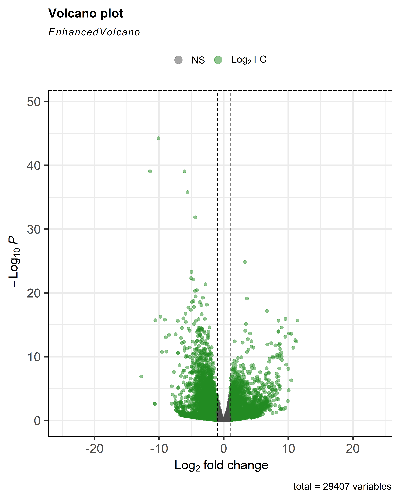

# Transcriptomics-Jaar-2
 
Welkom bij mijn Github-pagina Dewi ;)

Marike Meijberg
LBM2A - J2P4 - Transcriptomics

# Transcriptomics 

> `I will not have you in my class if you continue to be a babbling, bumbling band of baboons who can't even SORT their data!`

## 📁 Inhoud/structuur

- `Introductie` – Korte introductie en achtergrond informatie.  
- `Methode` - Methode gebruikt voor analyses. 
- `Scripts` – Scripts voor extra uitleg over de gebruikte analyses en methodes. 
- `Resultaten` - Volcanoplot, go-analyse en KEGG analyse.
- `Bronnen` - Gebruikte bronnen.
- `README.md` - Het document om de tekst hier te genereren.

---

## 🧠 Introductie

Deze GitHub pagina staat in het teken van magische spreuken en hun eigenschappen (Harry Potter⚡). Met behulp van historische registergegevens kan de **kracht**, **nauwkeurigheid** en het **risiconiveau** geanalyseerd worden. Voor een goede tovenaar is het van belang dat de gebruikte spreuken effectief en veilig zijn om te gebruiken. Daarnaast is het van belang voor elke tovenaar om rekening te houden met de compatibiliteit van het type toverstok dat gebruikt wordt om de geschiktheid van spreukgebruik af te stemmen.  

Heb je Harry Potter nooit gelezen? Moet je echt doen, [klik maar hier](bronnen/harry-potter.pdf).

## 🧬 Methoden
Voor deze transcriptomics-analyse werd gebruikgemaakt van RNA-sequencingdata van acht personen: vier met reumatoïde artritis (RA) en vier zonder RA. De [ruwe sequencingbestanden](Ruwe%20data/)
 (FASTQ) werden uitgepakt en ingelezen in R. Vervolgens werd het [humane referentiegenoom](Referentie%20genoom) geïndexeerd met het pakket Rsubread, waarna de reads van de samples werden uitgelijnd met de functie align(). De gegenereerde [BAM-bestanden](BAM%20files) zijn gebruikt voor analyse.
Met featureCounts werd er een countmatrix gemaakt, waarbij een aangepaste GTF-annotatie werd gebruikt om alleen op exons te tellen. Vervolgens is er een [volledige count-matrix](Count%20matrix) gebruikt voor verder onderzoek.
De verschillen in genexpressie tussen RA en controle werden bepaald met het pakket DESeq2. De resultaten werden geëxporteerd naar een CSV-bestand en gevisualiseerd met behulp van EnhancedVolcano.
Vervolgens werd met een R-pakket (goseq) onderzocht welke biologische processen verhoogt voorkwamen in genen die anders tot expressie kwamen bij RA. Deze processen (Go-termen) kunnen betrokken zijn bij de ziekte en werden gevisualiseerd met behulp van ggplots2. Daarna is er een KEGG-analyse om dieper in te gaan op de biochemische pathways, die zijn gevisualiseerd met behulp van pathview. Het onderzoek is vastgelegd volgend de principes van data stewardship, met duidelijke mappen structuur en reproduceerbaarheid. 

📄 **[Klik hier voor het volledige script](script.R)**  

## 📊 Resultaten

**🌋 Volcanoplot van genexpressie (EnhancedVolcano)**

Bijschrift komt hier

**[Afbeelding vergroten 🔍](Resultaten/Volcanoplot.png)**

Hier komt gewone text wat is er zichtbaar

**🌋 Volcanoplot van genexpressie (EnhancedVolcano)**

**[Afbeelding vergroten 🔍](Resultaten/hsa05323%20pathview%20results.png)**

**🌋 Volcanoplot van genexpressie (EnhancedVolcano)**

Bijschrift komt hier

**[Afbeelding vergroten 🔍](Resultaten/hsa05323%20pathview%20results.png)**

Hier komt gewone text.

## Conclusie

Spreuken met meer accuraatheid lijken minder krachtig te zijn. Een uitzondering op deze trend is de onvergeeflijke vloek *Avada Kedavra*, welke beter niet gebruikt kan worden. 